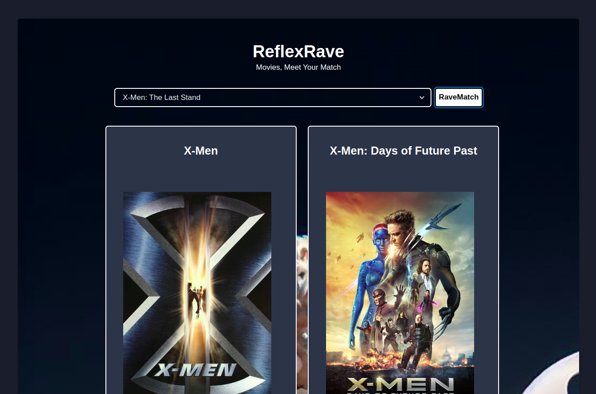
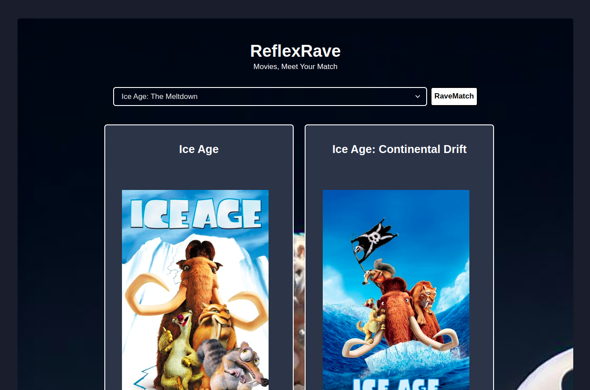

# ReflexRave
- ReflexRave is a movie recommendation system powered by machine learning, trained on the TMDB dataset of 5000 movies.
- The app is built using **`python`** and **`Reflex`** framework and uses `TMDB` API to fetch the movie data.

<br>

# Look and Feel




<br>

# Create your TMDB API key

1. Go to the [TMDB](https://developer.themoviedb.org/docs) website and sign up for a free account.
2. Once you are logged in, click your Profile Icon in the top right corner and then select Settings.
3. On the left side menu click API and then click Create in the middle of your screen.
4. Fill out this form asking you for your address, phone number, and other information. You can use real or fake information, it doesn’t matter. At the end of this screen when you submit the information, you will be given a TMDB API Key.


NOTE: You can skip this step if you already have a TMDB API key.

<br>

# Installation

1. Clone the repository
```bash
git clone https://github.com/HeetVekariya/hacktoberfest.git
```

2. Navigate to the project directory
```bash
cd hacktoberfest/submissions/ai_apps/heet_reflexrave/ReflexRave
``` 

3. Make virtual environment and activate it
```bash
python -m venv venv
source venv/bin/activate
```

4. Install the dependencies
```bash
pip install -r {path to requirements.txt}
reflex init
```

5. Add your TMDB API key to the `state.py` file, replace `<YOUR_TMDB_API_KEY>` with your API key.
```python
response = requests.get('https://api.themoviedb.org/3/movie/{}?api_key=<YOUR_TMDB_API_KEY>'.format(movie_id))
```

6. Run the app
```bash
reflex run
```


