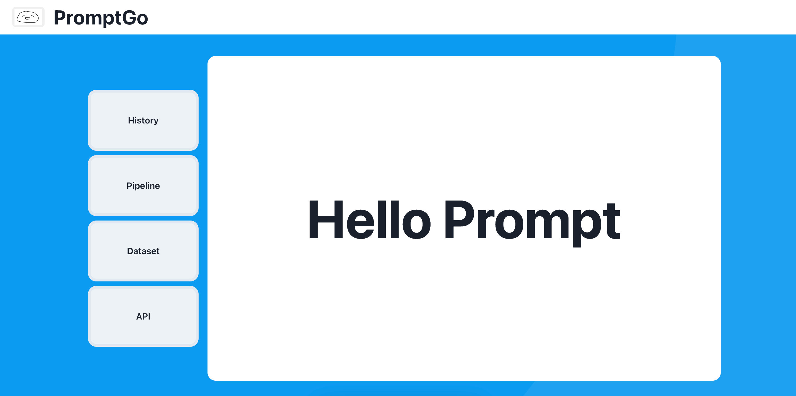

# PromptGO 
**A Tool for Prompt Version Management in LLM Related Projects**  
*(A experiment project composed with 'plastic' code and 'shit mountain' code)*
<div align="center">

</div>   


# Getting Started
### Env  
- The project is developed based on [Reflex](https://github.com/reflex-dev/reflex) (a python binding for react web)
```shell
# Requires Python 3.8+ with Reflex
$ pip3 install -r requirements.txt  

# set OPENAI_API_KEY for chatgpt
$ cp prompt_go/.env_copy prompt_go/.env
or
$ export OPENAI_API_KEY='xxxx'
```   

### Run
```
$ cd prompt_go 
$ reflex init
$ reflex db init  
$ reflex run
```

# Modules & Cores
  

## API
### register api
- `chat api`: for prompt node run, any llm api
- `score api`: for rate the prompt result, any llm api
- `norml api`: for preprocess and postprocess node like pdf parse、image ocr、reformat result……
- ~but, above not implement yet~
## Dataset
- add dataset for specific node run
## Pipeline
- build single node with specific dataset and get AI score 
- add new version of existed node  
- [ ] build a chain of cascade nodes to run a pipeline
## History
- review one node's running result
- compare two node's result, especially for different version prompt node
- modify item score manually
- [ ] save node's output as new dataset

# Todo
- code optimizing, such as duplicated func、multiple if-else-for……
- add user profile
- function not implemented list in `Modules` part
- AI score prompt optimizing
- bug in check UI for remove situation
- ……

# Last
- Reflex is a good choice for quickly build AI demos for PYTHONers, but not  so good at serving speed and complex components like native react. It is worth recommending anyway and reflex has many kind contributors. 
- This project is a experiment demo, just try and stop here
