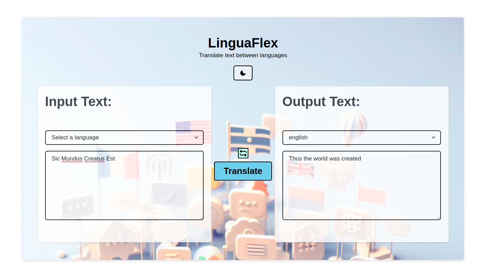
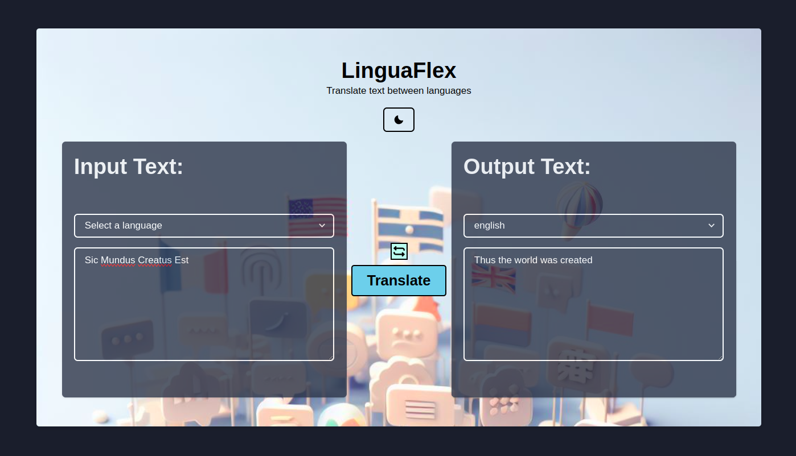

# LinguaFlex
- A language translation app that uses the Google Translate API to translate text from one language to another.
- The app is built using **`python`** and **`Reflex`** framework.

<br>

# Look and Feel

### Light mode


<br>

### Dark mode



<br>

# Installation

1. Clone the repository
```bash
git clone https://github.com/HeetVekariya/hacktoberfest.git
```

2. Navigate to the project directory
```bash
cd hacktoberfest/submissions/miscellaneous/heet_linguaflex/LinguaFlex
``` 

3. Make virtual environment and activate it
```bash
python -m venv venv
source venv/bin/activate
```

4. Install the dependencies
```bash
pip install reflex
reflex init
pip install -r {path to requirements.txt}
```

**NOTE**: If you find any error while running `reflex init` command, for once ignore it and complete the process. It will work fine.

5. Run the app
```bash
reflex run
```


