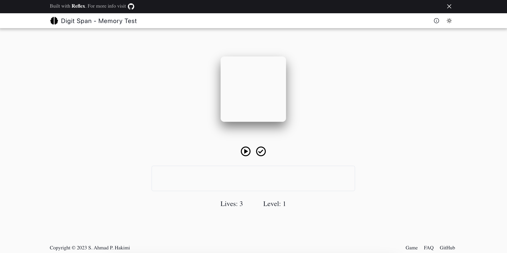

<h1 align="center" style="font-size: 5em; font-weight: 100;">Digit Span Memory Game</h1>

 

The Digit Span Test is a psychological assessment tool used to measure a person's short-term memory capacity. It involves recalling and repeating sequences of digits in the same order they were presented.

## Digit Span Game Website

You can play the game by visiting the [Digit Span](https://memory-span.vercel.app/) site

## How To Play

1. To begin, press the `start` button to generate a sequence of digits.

2. Once the sequence is generated, enter the numbers inside the input field.

3. Press the `check` button to see if your input matches the sequence. 

If your input is incorrect, you lose a life and can re-try. There is a maximum of 3 lives.

If your input matches the sequence, you advance to the next level.

